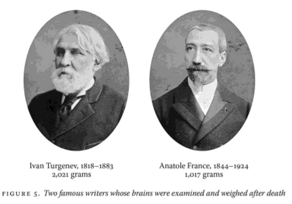
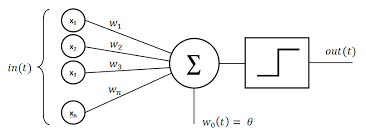
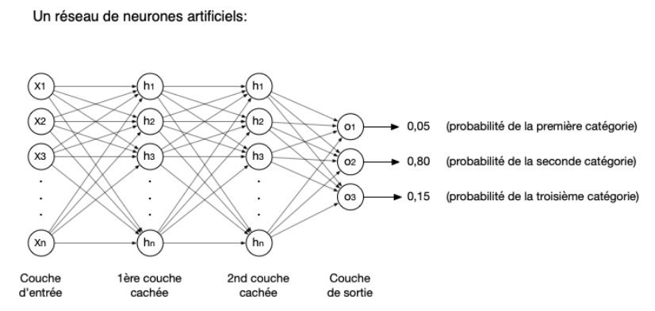
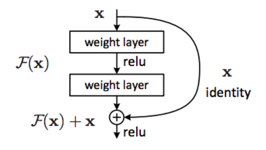
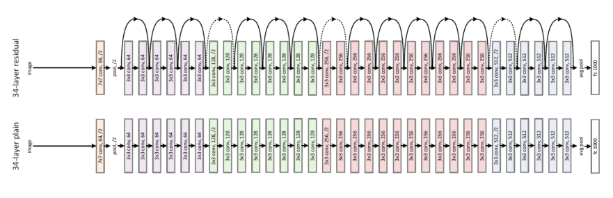

---
jupytext:
  notebook_metadata_filter: rise
  text_representation:
    extension: .md
    format_name: myst
    format_version: 0.13
    jupytext_version: 1.14.5
kernelspec:
  display_name: Python 3 (ipykernel)
  language: python
  name: python3
rise:
  auto_select: first
  autolaunch: false
  centered: false
  controls: false
  enable_chalkboard: true
  height: 100%
  margin: 0
  maxScale: 1
  minScale: 1
  overlay: "
Introduction \xE0 la\
    \ Science des Donn\xE9es, L1 Math-Info, Facult\xE9 des Sciences d'Orsay
<div\
    \ style='position: absolute; top: 0; right: 0'>
"
  scroll: true
  slideNumber: true
  start_slideshow_at: selected
  transition: none
  width: 90%
---

+++ {"slideshow": {"slide_type": "slide"}, "user_expressions": []}

# Cours 8: Deep Learning et classification d'images

 

Fanny Pouyet

L1 Informatique

Janvier - Avril 2023

+++ {"slideshow": {"slide_type": "slide"}}

**Précédemment**

* Chaine de traitement d'analyse de données
* Application aux images : extraction de features
* Classificateurs
* Préparation des données : traitement d'images
* Biais dans les données : utilisation de métadonnées

**Cette semaine**

* Deep Learning et classification d'images

+++ {"slideshow": {"slide_type": "slide"}}

## Introduction : Deep Learning ou apprentissage profond 

* L'apprentissage statistique (*Machine Learning*) : ensemble de techniques permettant d’estimer des règles à partir de données
* L'apprentissage profond (*Deep Learning*) : apprentissage statistique reposant sur des réseaux neurones dont les dimensions vont apporter une plus ou moins grande complexité à l’établissement des règles.

+++ {"slideshow": {"slide_type": "slide"}}

Quand avons nous déjà parlé d'apprentissage profond / réseau de neurones ?

+++ {"slideshow": {"slide_type": "fragment"}}

Avec le perceptron, au CM5

+++ {"slideshow": {"slide_type": "slide"}}

### Les neurones en biologie

Neurones = cellules assurant la transmission d'un signal dans notre organisme (des dentrites jusqu'aux axones terminaux). 

 

+++ {"slideshow": {"slide_type": "slide"}}

#### Apercu du mécanisme
* Activation (dendrites): entrée de molécules de signal
* Transformation en signal électrique et transport le long de l'axone (par une variation de la concentration en ions entre l'environnement intra et extracellulaire)
* Arrivée : interprétation en une action ou bien en un transfert vers un autre neurone (par sécretion de molécules de signal).

+++ {"slideshow": {"slide_type": "slide"}}

#### Quelques statistiques sur les neurones
* $10^{11}$ = 100 milliards de neurones *par individu* (équivalent au nombre d'étoiles dans la Voie Lactée)
* nerf sciatique = le plus long (> 1m)
* $10^{14}$ synapses, zones de contact entre neurones chez l'adulte

 

+++ {"slideshow": {"slide_type": "slide"}, "user_expressions": []}

### Les premiers neurones en informatique

#### McCulloch et Pitts, 1943
Le premier neurone artificiel (modélisation mathématique des neurones biologiques)

 

 Pouvez vous le décrire ?

+++ {"slideshow": {"slide_type": "slide"}}

* un seul neurone
* une fonction d'activation $F$, de type "tout ou rien" (seuil d'activation)
* Un signal d'entrée binaire $x_j = 0 $ ou $1$

+++ {"slideshow": {"slide_type": "slide"}}

 

+++ {"slideshow": {"slide_type": "slide"}, "user_expressions": []}

#### Perceptron (Rosenblatt, 1957)

Premier algorithme d'apprentissage supervisé dont l'objectif est de distinguer 2 classes. L'unique couche du perceptron contient un neurone et calcule une combinaison linéaire $w_0 + \sum w_j x_j$ des signaux $x_1,...x_n$. On applique alors une fonction d'activation et on transmet en sortie le résultat

 https://commons.wikimedia.org/wiki/File:Perceptron_moj.png

+++ {"slideshow": {"slide_type": "slide"}, "user_expressions": []}

**Les fonctions d'activation (les plus simples)**

* L'identité (pour les problèmes de régression)
* Seuil d'activation (pour les problèmes de classification)
* Intervalles d'activation (si on a plus de 2 classes)
* Autres fonctions plus complexe, on en mentionnera quelques unes un peu plus tard

+++ {"slideshow": {"slide_type": "slide"}, "user_expressions": []}

#### Perceptron multi-classe 

Une proposition parmi d'autres si on a $C>2$ classes.

* pas 1 mais $C$ neurones dans la couche de sortie (un neurone par classe)
* les $n$ neurones de la couche d'entrée sont tous connectés à chacun des neurones de sortie
* on a donc $n\times C$ poids de connexions, notés $w_j^c$
* les classes sont supposées non chevauchantes

+++ {"slideshow": {"slide_type": "slide"}}

## Le deep learning comme *réseau* de neurones

**Réseau de neurones artificiel** : un ensemble de modèles (classifieurs par ex.) dont l'architecture est articulée en *couches*. Les couches sont composées de différentes transformations non linéaires: des couches de perceptron, des convolutions ou autres transformations.

**Le réseau le plus simple est un réseau entièrement connecté, mais il est difficile à optimiser !**

+++ {"slideshow": {"slide_type": "slide"}}

**Poids** 

* Les **poids** sont les paramètres appris par le réseau, associés aux neurones et optimisés lors de l'entraînement. 
* L'entrainement se fait selon la technique de la descente de gradient (vous le verrez en IAS en L3)

+++ {"slideshow": {"slide_type": "slide"}}

**Spécificité des réseaux de neurones**

* les valeurs d'entrée sont les données brutes et non plus les attributs.
* les poids deviennent en quelque sorte des attributs de nos images

+++ {"slideshow": {"slide_type": "slide"}, "user_expressions": []}

### Perceptron multi-couche (MLP, multi layer perceptron)

 

+++ {"slideshow": {"slide_type": "slide"}, "user_expressions": []}

On en a utilisé un lors du CM5 et avec [Marcelle](https://demos.marcelle.dev/).
* Les couches intermédiaires sont appelées couches cachées (*hidden layers*).
* Chaque neurone d'une couche intermédiaire ou de la couche de sortie, recoit en entrée les sorties des neurones de la couche précédente
* Il n'y a pas de cycle
* La complexité vient des fonctions d'activation qui peuvent etre complexes

+++ {"slideshow": {"slide_type": "slide"}}

### Réseau neural convolutif - Convolutional neural network, CNN ou ConvNet

 

* multiples perceptrons empilés
* chaque perceptron traite une sous-tache

+++ {"slideshow": {"slide_type": "slide"}, "user_expressions": []}

#### Traitement convolutif

Définition lors du [CM6](../Semaine6/CM6.md).

#### Organisation des CNN

Succession de strates. Chaque strate contient plusieurs couches:
* Couche de convolution
* Couche de correction
* Couche de compression
* Couche entièrement connectée

+++ {"slideshow": {"slide_type": "slide"}}

##### Couche de convolution

* Neurones de traitement : analyse une sous-image selon un mode de convolution défini
* Trois hyperparamètres : la profondeur, le pas et la marge.
    * Profondeur : nombre de noyaux de convolution
    * Pas : décalage des noyaux de convolution (avec ou sans chevauchement)
    * Marge : la taille des marges de l'image pour gérer les extrémités lors des calculs de convolution
* Dans une même couche, les valeurs des paramètres des neurones sont tous identiques.

+++ {"slideshow": {"slide_type": "slide"}, "user_expressions": []}

##### Couche de correction

* Opère une fonction d'activation sur les sorties des neurones précédents. Par rapport aux fonctions d'activation précédentes, on notera qu'il existe aussi:

* La correction ReLU (abréviation de Unité Linéaire Rectifiée) : $f(x)=\ max(0,x)$. On est linéaire une fois activé.
* La correction par la fonction sigmoïde $f(x)=(1+e^{-x})^{-1}$.

+++ {"slideshow": {"slide_type": "slide"}}

##### Couche de compression

* Neurones de pooling : regroupent les sorties de convolution
* forment une image intermédiaire qui servira de nouvelle "image" d'analyse
* Le pooling permet de réduire la dimension des images intermédiaires
* réduit le risque de surapprentissage

+++ {"slideshow": {"slide_type": "slide"}}

##### Couche entièrement connectée (*FC, fully connected*)

En fin de réseau, on utilisera des couches entièrement connectées aux sorties de la couche précédente. Leurs fonctions d'activations peuvent être calculées avec une multiplication matricielle et permettent *in fine* de classifier nos images.

+++ {"slideshow": {"slide_type": "slide"}}

### Region-based CNN (2013)

On peut aussi spécialiser régionalement notre analyse. On parle alors de R-CNN (region based CNN, à ne pas confondre avec les RNN pour recursive neural networks -- hors programme).

 
    http://wider-challenge.org/img/2019/portfolio/pedestrian.jpeg

+++ {"slideshow": {"slide_type": "slide"}}

* On identifie les régions d'interet (*ROI, regions of interest*) en utilisant un mécanisme de recherche sélective
* Chaque ROI est un rectangle (idéalement, entourant nos objets)
* Ensuite, chaque ROI est donné comme entrée d'un réseau de neurone puis est classifié

+++ {"slideshow": {"slide_type": "slide"}, "user_expressions": []}

**RCNN en python**

* Il existe des réseaux pré-entrainés, capables de reconnaitre de nombreux objets de la vie quotidienne.
* C'est très facile à utiliser, mais ca ne vous dit pas comment ils ont été entrainés ni construits !
* La librairie OpenCV contient le réseau YOLO qui est entrainé
* cvlib (*computer vision library*) contient aussi un réseau préentrainé

 

+++ {"slideshow": {"slide_type": "slide"}}

## Vision par ordinateur

### Jeu de données de référence : ImageNet
* Collaboration entre l’université de Stanford et celle de Princeston.
* 15 millions d’images et 22.000 catégories.

+++ {"slideshow": {"slide_type": "slide"}, "user_expressions": []}

### ImageNet Large Scale Visual Recognition Challenge (ILSVRC) : 
* De 2010 à 2017:
    * 1 000 images par catégorie,
    * 50 000 images de validation,
    * 150 000 images de test.
* Objectif : faire avancer la recherche dans le domaine de la vision par
ordinateur
* ImageNet continue à être utilisé dans de nombreux projets comme jeu de test.

+++ {"slideshow": {"slide_type": "slide"}}

### Quelques exemples connus de CNN qui ont remporté l'ILSVRC

**Inception network de Google** 
 
 

* nouveau concept : module Inception

+++ {"slideshow": {"slide_type": "slide"}, "user_expressions": []}

 

* 22 couches

+++ {"slideshow": {"slide_type": "slide"}}

**ResNet de microsoft research Asia**

 

* nouveau concept : introduire une connexion de raccourci qui saute une ou plusieurs couches.

+++ {"slideshow": {"slide_type": "slide"}, "user_expressions": []}

 

* 152 couches !

+++ {"slideshow": {"slide_type": "slide"}, "user_expressions": []}

## Comité de classificateurs et incertitude : comparaison

Comme en [Semaine5](../Semaine5/5_classificateurs.md), on va:
- définir un ensemble d'entrainement et de test
- classifier les images selon différents classificateurs

Ce qui est nouveau, on fait voter les classificateurs et choisir la classe finale (= comité de classificateurs). Vous ferez ca dans la [feuille 4 de la Semaine 8](4_classificateurs.md)

**Comité de classificateurs** : classificateur dans lequel les réponses de plusieurs classificateurs sont combinées en une seule réponse.

+++ {"slideshow": {"slide_type": "slide"}}

### Gestion de l'incertitude

Lors d'un comité, il en existe plusieurs types:
- **l'incertitude aléatorique** : les classificateurs sont plus ou moins certains de leur prédiction. 
- **l'incertitude épistémique** : les classificateurs sont d'accord ou pas entre eux. 

Ces incertitudes vont être d'autant plus fortes pour les images proches des frontières de décision (les bananes rouges par exemple).

+++ {"slideshow": {"slide_type": "slide"}, "user_expressions": []}

#### Incertitude aléatorique

On estime cette incertitude en calculant l'entropie de Shanon, qui est une mesure issue de la théorie de l'information. 

**Entropie de Shannon** : mesure la quantité d'information contenu dans une source. Ici, notre probabilité d'appartenir à une classe: 

$H(X) = 1- \sum_iP(x_i)\log_2(x_i)$  avec  $x_i$ la probabilité de classification sur la classe $i$.

+++ {"slideshow": {"slide_type": "slide"}}

#### Incertitude épistémique

Chaque classificateur estime une classe d'une image avec une certaine probabilité. On peut alors calculer l'incertitude de la classe d'une image en calculant l'écart-type de ces probabilités. L'incertitude épistémique de notre comité correspond à la moyenne des incertitudes des images.

+++ {"slideshow": {"slide_type": "slide"}, "user_expressions": []}

## Conclusions

* Deep Learning: réseau de neurones, perceptron multi-couches, CNN ...
* Grand jeu de données réputé difficile : ImageNet, qui sert de jeu de test
* Deux exemples d'architectures de CNN qui ont marqué le domaine de la vision par ordinateur

+++ {"heading_collapsed": true, "slideshow": {"slide_type": "slide"}, "user_expressions": []}

## Perspectives

* **CM9**
    * Impact écologique et impact sociétal de l'intelligence artificielle
